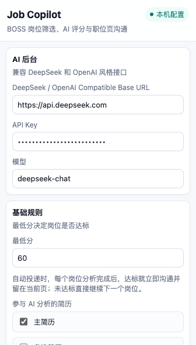
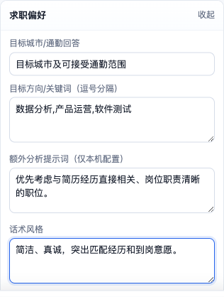
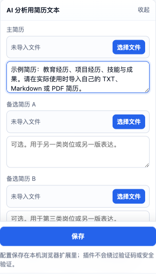
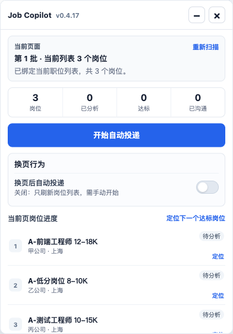
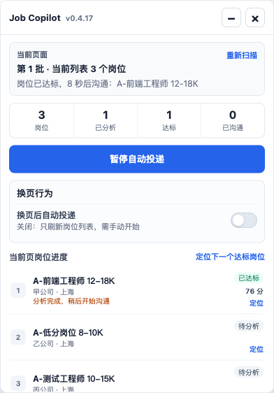
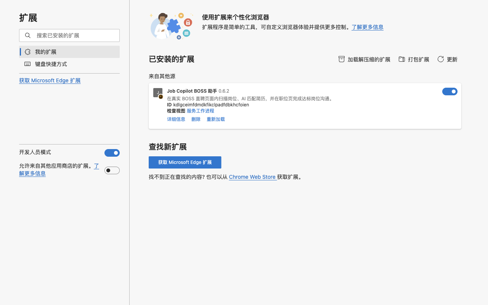
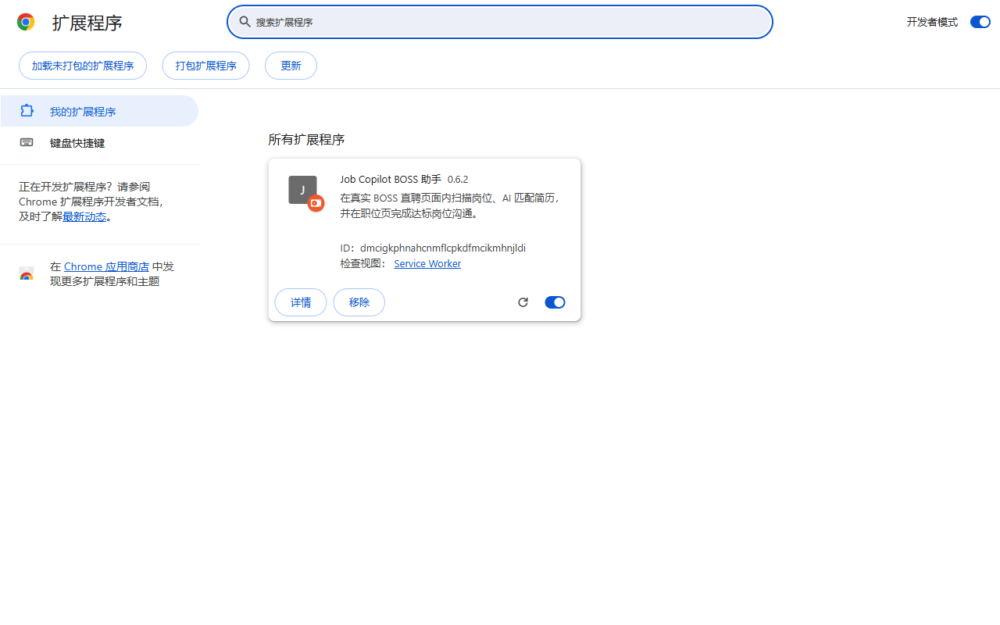
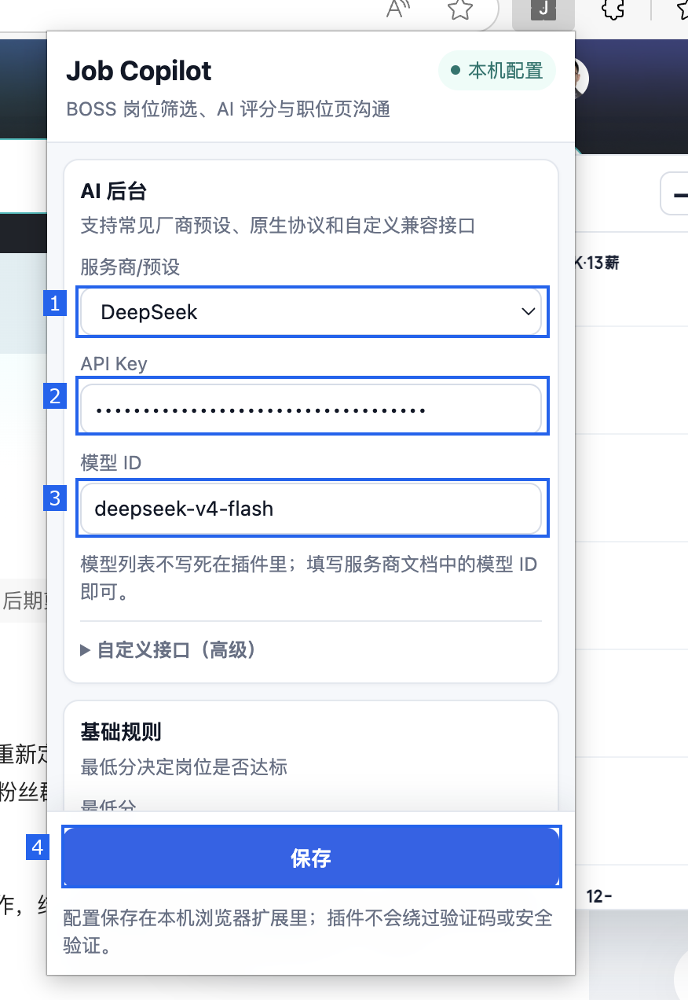
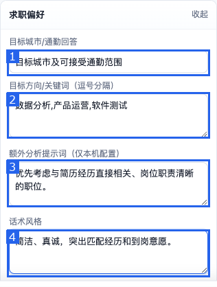
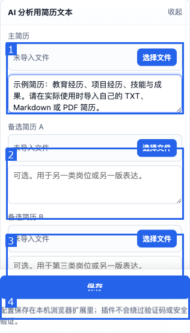

# Job Copilot BOSS 助手

当前版本：`0.6.8`

Job Copilot 是一个面向求职者的 Chromium 浏览器扩展。它在 BOSS 直聘职位页读取岗位信息，将用户主动配置的求职偏好、简历和完整 JD 交给用户选择的 AI 服务评分，并按用户设置的分数线处理岗位。扩展支持 OpenAI Chat Completions、OpenAI Responses、Anthropic Messages、Gemini generateContent、Azure OpenAI 和常见 OpenAI 兼容接口。

> 本项目不隶属于 BOSS 直聘或 DeepSeek。自动化操作可能受到招聘平台规则、账号风控和页面更新影响。请控制使用频率，遵守平台条款，并对最终投递行为负责。

## 功能概览

- 扫描当前 BOSS 职位列表，不擅自切换“推荐”、行业或用户创建的职位页签。
- 读取岗位标题、公司、薪资、地区和右侧完整 JD。
- 支持 DeepSeek、OpenAI、Anthropic Claude、Google Gemini，以及兼容 OpenAI Chat Completions 的国内外服务商和本机模型。
- 支持 TXT、Markdown 和可复制文本型 PDF 简历。
- 支持主简历、备选简历 A、备选简历 B，并可同时勾选多份简历参与分析。
- AI 综合求职偏好、简历证据、岗位门槛、工作地点和机会质量给出 0-100 分。
- 达到用户分数线的岗位才执行沟通；未达标岗位直接继续。
- 岗位级进度列表展示待分析、分析中、达标、未达标、已沟通和失败状态。
- 每批最多处理 15 个岗位，批次之间默认冷却 60 秒。
- 支持暂停、继续、换页后自动运行和失败岗位重新分析。
- 不处理 HR 自动回复，不发送附件简历，不绕过验证码或安全验证。

## 界面预览

所有截图均使用本地演示数据，不包含真实账号、简历或 API Key。

### 1. 配置 AI 与分数线



### 2. 填写通用求职偏好



### 3. 导入简历



### 4. 使用职位页控制面板



### 5. 查看分析和投递进度



## 浏览器支持

- Microsoft Edge：支持。
- Google Chrome：支持。
- 其他 Chromium 浏览器：理论上可用，但需要自行验证。
- Safari：当前版本尚不支持，未来计划支持；Safari Web Extension 仍需单独转换、签名和测试。

## 安装教程

### 1. 下载并解压安装包

1. 打开仓库的 [Releases 页面](https://github.com/JackZeng1057/job-copilot-boss-assistant/releases/latest)。
2. 在最新版本下方展开 `Assets`，下载 `Job-Copilot-BOSS-Assistant-vX.X.X.zip`。
3. 将 ZIP 完整解压到一个固定目录。安装后不要删除或移动该目录，否则浏览器会找不到扩展文件。

> 不要直接选择 ZIP 文件，也不要选择 ZIP 外层的下载目录。最终选择的文件夹中应当能直接看到 `manifest.json`。

### 2. 在 Microsoft Edge 中安装

1. 在地址栏打开 `edge://extensions/`。
2. 打开左下角的“开发人员模式”。
3. 点击页面上方的“加载解压缩的扩展”。
4. 选择刚才解压后、直接包含 `manifest.json` 的文件夹。
5. 看到 `Job Copilot BOSS 助手` 卡片且右侧开关已开启，即表示安装成功。



### 3. 在 Google Chrome 中安装

1. 在地址栏打开 `chrome://extensions/`。
2. 打开右上角的“开发者模式”。
3. 点击页面上方的“加载已解压的扩展程序”。
4. 选择刚才解压后、直接包含 `manifest.json` 的文件夹。
5. 看到 `Job Copilot BOSS 助手` 卡片且开关已开启，即表示安装成功。



Chrome 与 Edge 的扩展管理页布局略有不同，但安装流程和所选目录完全相同。截图中的扩展 ID 由所加载的源码目录生成，仅用于确认扩展已经成功加载，无需手动填写。

### 4. 固定扩展并完成首次配置

1. 点击浏览器工具栏中的拼图形“扩展”按钮。
2. 在扩展列表中找到 `Job Copilot BOSS 助手`，点击其右侧的固定图标。
3. 固定成功后，工具栏会显示方形 `J` 图标；以后点击它即可打开配置页面。
4. 打开插件，填写自己的 AI 服务、API Key、模型 ID、求职偏好和简历。
5. 点击“保存”，并在浏览器询问时允许访问所填写的 AI 接口域名。
6. 登录 BOSS 直聘并进入职位列表页，点击页面右侧的 `JC` 按钮开始使用。


图中 `1` 是浏览器的扩展菜单，`2` 是固定后显示的 Job Copilot 图标。Edge 与 Chrome 的按钮位置可能略有差异。若工具栏没有显示 `J` 图标，请重新打开扩展菜单并确认 Job Copilot 已固定；不要在网页中的账号头像附近寻找插件入口。

### 更新版本

1. 从 Releases 下载并解压新版本，用新文件替换原扩展目录中的文件。
2. 回到 `edge://extensions/` 或 `chrome://extensions/`，点击扩展卡片中的“重新加载”。
3. 刷新已经打开的 BOSS 职位页。

扩展重载会让旧页面中的内容脚本失效，这是 Chromium 扩展的正常行为。升级前建议先暂停自动投递；本机浏览器存储中的配置通常会保留，但重要简历和提示词仍建议自行备份。

## 配置教程

点击浏览器工具栏中的 Job Copilot 图标。

### 首次配置四步法



1. **选择服务商**：选择 API Key 所属的 AI 厂商。常见厂商会自动匹配接口协议、认证方式和地址。
2. **填写 API Key**：粘贴自己从厂商官方控制台创建的密钥。输入后界面只显示圆点；README、Issue 和截图中都不要公开真实密钥。
3. **填写模型 ID**：从厂商官方模型文档复制精确 ID。模型 ID 不是中文产品名，也不会写死在插件源码里。
4. **保存配置**：滚动到页面底部点击“保存”。首次接入非默认域名时，浏览器可能请求接口域名访问权限，允许后配置才会生效。

保存后建议重新打开插件检查三个结果：服务商选择仍然正确、API Key 仍显示为掩码、模型 ID 没有被浏览器自动改写。然后继续填写最低分、求职偏好和简历并再次保存。

### AI 后台

- `服务商/预设`：先选择 API Key 所属的服务商，插件会自动填写协议、认证方式和 Base URL。
- `API Key`：填写用户自己在该服务商官方控制台创建的密钥。Ollama 本机模式不需要密钥。
- `模型 ID`：填写服务商模型页面显示的模型 ID，而不是模型的中文展示名称。模型列表不会写死在插件代码中。
- `自定义接口（高级）`：默认收起。仅自定义服务、Azure 或兼容网关需要设置；支持 OpenAI Chat Completions、OpenAI Responses、Anthropic Messages、Gemini generateContent 和 Azure OpenAI 完整端点。
- `认证方式`：常见厂商会自动选择；自定义 OpenAI 兼容接口可选 Bearer、`x-api-key`、`api-key` 或无认证。

默认仅授权访问 BOSS 和 DeepSeek。使用其他 AI 接口时，点击“保存”会请求该接口域名的单独访问权限；拒绝权限时不会保存该接口配置。远程接口必须使用 HTTPS，本机服务可以使用 `http://localhost` 或 `http://127.0.0.1`。AWS Bedrock、Vertex AI 等依赖云平台 OAuth/签名流程的接口不属于 API Key 直连模式，需要通过兼容网关接入。

#### 三步接入

1. 在下表对应的官方控制台创建 API Key，并在官方模型页面确认可用的模型 ID。
2. 在插件中选择同名的“服务商/预设”，粘贴 API Key，再填写模型 ID。
3. 点击“保存”。首次使用该域名时，浏览器会请求访问权限；允许后即可用于岗位分析。

API Key 的前缀不能可靠判断服务商，多个平台都可能使用 `sk-`。因此插件以用户选择的“服务商/预设”自动适配协议和地址，不会仅凭 Key 猜测厂商。

#### 厂商接入表

| 插件预设 | 获取 API Key / 官方教程 | 官方模型列表 | 插件中需要填写 |
| --- | --- | --- | --- |
| DeepSeek | [快速开始](https://api-docs.deepseek.com/) | [模型与更新](https://api-docs.deepseek.com/updates/) | API Key；模型可填 `deepseek-v4-flash` 或官方当前提供的其他模型 ID。 |
| OpenAI | [API Keys](https://platform.openai.com/api-keys) | [Models](https://developers.openai.com/api/docs/models) | API Key；从 Models 页面复制可用模型 ID。 |
| Anthropic Claude | [API 概览与密钥说明](https://platform.claude.com/docs/en/api/overview) | [Models API](https://platform.claude.com/docs/en/api/models-list) | API Key；填写 Claude 模型 ID。插件自动使用 Anthropic Messages 和 `x-api-key`。 |
| Google Gemini | [创建 Gemini API Key](https://ai.google.dev/gemini-api/docs/api-key) | [Gemini models](https://ai.google.dev/gemini-api/docs/models) | API Key；填写支持 `generateContent` 的模型 ID。 |
| 阿里云百炼 / 通义千问 | [获取 API Key](https://help.aliyun.com/zh/model-studio/get-api-key) | [模型列表](https://help.aliyun.com/zh/model-studio/models) | API Key；填写 Qwen 模型 ID。默认预设使用中国内地北京地域的兼容接口。 |
| Moonshot / Kimi | [Kimi API 快速开始](https://platform.kimi.com/docs/overview) | [模型列表](https://platform.kimi.com/docs/models) | API Key；填写 Kimi 模型 ID。 |
| 智谱 GLM | [快速开始](https://docs.bigmodel.cn/cn/guide/start/quick-start) | [模型概览](https://docs.bigmodel.cn/cn/guide/start/introduction) | API Key；填写 GLM 模型 ID。预设使用通用 API，不使用 Coding 套餐专属端点。 |
| SiliconFlow | [快速上手](https://docs.siliconflow.cn/cn/userguide/quickstart) | [模型列表 API](https://docs.siliconflow.cn/cn/api-reference/models/get-model-list) | API Key；填写完整模型 ID，通常包含组织或模型路径。 |
| OpenRouter | [API 认证](https://openrouter.ai/docs/api/reference/authentication) | [Models](https://openrouter.ai/models) | API Key；填写带厂商前缀的模型 ID，例如官方模型页展示的 `provider/model`。 |
| Groq | [Quickstart](https://console.groq.com/docs/quickstart) | [Supported Models](https://console.groq.com/docs/models) | API Key；填写 Groq 模型 ID。 |
| Together AI | [Quickstart](https://docs.together.ai/docs/quickstart) | [Serverless Models](https://docs.together.ai/docs/serverless-models) | API Key；填写 Together 模型 ID。 |
| Ollama 本机 | [下载 Ollama](https://ollama.com/download) | [模型库](https://ollama.com/search) | 不填 API Key；先在本机拉取模型，再填写本地模型名。 |
| Azure OpenAI | [REST API 参考](https://learn.microsoft.com/azure/ai-foundry/openai/reference) | [模型与部署说明](https://learn.microsoft.com/azure/ai-foundry/openai/concepts/models) | API Key、部署所用模型 ID，并在高级设置中填写包含部署名和 `api-version` 的完整端点。 |

厂商可能调整模型、价格、地域和接口版本，README 不固定推荐某个付费模型。以官方模型页面和当前账号实际开通权限为准。

#### 特殊情况

- **阿里云百炼其他地域或子工作空间**：API Key 与地域必须对应。若不是默认的中国内地北京地域，请选择“其他/自定义”，按[官方地域说明](https://help.aliyun.com/zh/model-studio/get-api-key)填写对应的 OpenAI 兼容 Base URL。
- **Azure OpenAI**：选择 Azure 预设后会自动展开高级设置。Base URL 必须是完整 Chat Completions 端点，例如 `https://<resource>.openai.azure.com/openai/deployments/<deployment>/chat/completions?api-version=<version>`；不要只填资源域名。
- **Ollama 本机**：先安装并运行 Ollama，再执行 `ollama pull <模型名>`。插件预设使用 `http://localhost:11434/v1` 且无需认证；详情见 [Ollama OpenAI compatibility](https://docs.ollama.com/api/openai-compatibility)。
- **其他 OpenAI 兼容平台或自建网关**：选择“其他/自定义”，在高级设置中选择 OpenAI Chat Completions，填写服务商给出的 Base URL 和认证方式。
- **AWS Bedrock、Google Vertex AI**：其原生接口通常依赖云 IAM、OAuth 或请求签名，不能只粘贴普通 API Key 直连。需要先通过用户自己的 OpenAI 兼容网关接入。

#### 常见接入错误

- `401` / `Unauthorized`：API Key 错误、已失效，或者 Key 与所选服务商/地域不匹配。
- `403` / 浏览器拒绝访问：保存配置时没有允许扩展访问该 API 域名，重新保存并允许权限。
- `404`：模型 ID 不存在，或自定义 Base URL 已经包含了不应重复填写的路径。
- `429`：余额、套餐、并发或调用频率受限；到对应厂商控制台检查额度。
- `model not found`：不要填写“GPT”“Claude”“通义千问”等展示名称，应从官方模型页面复制精确模型 ID。
- 返回空内容或 JSON 不完整：换用支持稳定文本输出的模型，检查余额和上下文限制后点击“重新分析”。

### 基础规则

- `最低分`：范围 0-100，默认 60。
- `参与 AI 分析的简历`：可多选；模型会综合所有已勾选且有正文的简历。

### 求职偏好



1. **目标城市/通勤回答**：填写希望工作的城市、区域及可接受的通勤范围，例如“杭州；滨江、余杭优先，可接受地铁 60 分钟”。这里写求职范围，不要填写身份证号或家庭详细住址。
2. **目标方向/关键词**：使用逗号分隔希望寻找的岗位方向、技能或行业，例如“前端开发，软件测试，数据分析”。可以填写多个方向，AI 会结合勾选的简历和实际 JD 判断，不是简单按单个词命中。
3. **额外分析提示词**：补充个性化条件和评分侧重点，例如接受应届岗位、优先工作内容、不接受销售性质岗位等。提示词只影响当前用户的 AI 分析，不会写入插件源码，也不会带给其他安装者。
4. **话术风格**：控制达标岗位生成的沟通表达，例如“简洁、真诚，突出相关项目和到岗意愿”。不要在这里预先写死某家公司或某个岗位名称。

配置建议：先写清楚真正不能接受的硬条件，再写优先项；不要把所有相近职位都写成排除项。保存后可先运行少量岗位，根据实际评分再调整关键词和额外提示词。

这些字段都保存在当前用户自己的浏览器中，源码不包含预设个人简历、姓名、目标地区或求职关键词。

### 简历导入



1. **主简历**：上传最通用或最希望优先使用的一份简历。可选择文件，也可以把完整简历正文直接粘贴到下方文本框。
2. **备选简历 A**：用于另一类岗位方向，例如把开发经历和测试经历分别整理成不同版本。不需要多方向时可以留空。
3. **备选简历 B**：用于第三类岗位或另一版表达，同样为可选项。插件不会要求三份简历都填写。
4. **保存**：文件解析或文本修改完成后点击页面底部“保存”。重新打开插件时应能看到导入文件名和解析后的正文。

支持的文件与处理方式：

- `TXT` / `Markdown`：直接读取文本。
- 可复制文本型 `PDF`：使用随扩展打包的 PDF.js 和本地 CMap 资源解析，不上传到第三方文件服务。
- 扫描件或图片型 `PDF`：PDF.js 无法进行 OCR，需要先自行 OCR，或将正文复制到文本框。

导入后务必检查文本框：教育经历、工作/实习经历、项目、技能和时间信息应能正常阅读；如果出现乱码、缺页或只有 PDF 元数据，不要直接开始分析，应重新导出可复制文本型 PDF 或粘贴正文。

最后回到“基础规则”的“参与 AI 分析的简历”中勾选需要使用的简历。可以同时勾选主简历和备选简历，AI 会综合所有已勾选且有正文的版本；未勾选或没有正文的简历不会参与评分。

界面显示的是已导入文件名；真正参与分析的是解析后的简历文本。

## 使用教程

1. 登录 BOSS 直聘并打开任意职位列表页。
2. 点击页面右侧 `JC` 按钮打开面板。
3. 检查面板识别到的岗位数量。
4. 点击“开始自动投递”。
5. AI 逐个读取完整岗位信息并评分。
6. 达标岗位等待约 8 秒后沟通，每个岗位结束后等待约 10 秒再继续。
7. 点击同一个主按钮可以暂停或继续，进度会保留。
8. 每批最多处理 15 个岗位；批次结束后等待 60 秒，再加载后续岗位。

“换页后自动投递”默认关闭：关闭时，切换职位分类只刷新岗位列表，需要用户再次点击开始；开启后，新列表识别完成会自动运行。

## 为什么不会再把职位页带到消息页

达标岗位的沟通动作不再直接发生在保存岗位列表的专用职位标签中。扩展会创建一个不激活的临时岗位详情标签，在该标签中执行 BOSS 原生“立即沟通”，并优先点击“留在此页”。

- 若 BOSS 正常显示“留在此页”，临时标签确认后关闭。
- 若 BOSS 强制把该标签带到消息页，跳转由临时标签吸收，随后关闭。
- 原职位标签不点击沟通按钮、不修改 URL，也不使用后退或刷新来恢复页面，因此列表和当前批次状态可以保留。
- 临时标签可能在标签栏短暂出现，这是隔离职位页导航的预期行为。

用户手动点击 BOSS 顶部“消息”时，会复用已有消息标签；若不存在，扩展会先复制当前职位标签，再只把复制品导航到消息页。原职位标签和其中的岗位列表、分析进度不会被修改。顶部消息链接本身也会移除直达消息页的地址，作为 Edge 事件绕过时的兜底保护。

## 评分系统

AI 对最终分数拥有决定权，扩展代码不会按固定职业名单、职位名称、关键词正则或城市正则二次抬分、压分或封顶。

### 100 分拆项

- 方向相关性 0-30
  - 标题/标签命中目标方向：0-10
  - JD 核心职责吻合：0-10
  - 技能、工具、行业语义相关：0-6
  - 多方向或额外偏好吻合：0-4
- 简历证据 0-25
  - 直接工作、实习或项目经历：0-8
  - 项目成果或作品证明：0-6
  - 技能工具证据：0-5
  - 学历、课程或证书：0-3
  - 可迁移经历：0-3
- 岗位门槛 0-20
  - 经验年限：0-5
  - 学历要求：0-4
  - 技能深度：0-5
  - 初级、应届或不限经验友好度：0-4
  - 其他硬性条件：0-2
- 地理位置 0-10
  - 城市/区域：0-4
  - 通勤或到岗方式：0-3
  - 远程、混合或灵活性：0-2
  - 地址可信度：0-1
- 机会质量 0-15
  - 薪资合理性：0-4
  - 职责成长价值：0-5
  - 公司/岗位风险：0-3
  - 沟通优先级：0-3

### 分数档位

- 90-100：高度匹配。
- 80-89：强匹配。
- 70-79：较好匹配。
- 60-69：合格可投。
- 50-59：人工复核，不自动沟通。
- 35-49：弱匹配。
- 20-34：明显偏离。
- 0-19：存在严重或硬性冲突。

运行代码只会将 AI 分数限制在 0-100，并与用户设置的最低分比较；达到分数线才进入沟通步骤。

## 隐私与权限

### 本地保存

以下内容保存在 `chrome.storage.local`：

- API Base URL、API Key 和模型名。
- 求职偏好和开关。
- 简历正文及导入文件名。
- 自动化进度与最近的本地运行日志。

Chromium 扩展存储不是端到端加密的密码保险箱。请保护浏览器账号和本机用户目录，不要提交浏览器配置目录，也不要把真实配置写入源码或 Issue。

### 对外发送

AI 分析时，扩展会把勾选的简历正文、求职偏好和岗位信息发送到用户配置的 AI 接口。API Key 只作为该请求的授权头使用。扩展不会把简历上传到 BOSS，也不会自动发送附件简历。

### 权限用途

- `storage`：保存本机配置和运行状态。
- `tabs`：保留职位标签、复制并打开独立消息标签、创建并关闭临时沟通标签。
- `https://www.zhipin.com/*`：读取职位列表和岗位详情。
- `https://api.deepseek.com/*`：调用默认 DeepSeek 接口。
- 可选接口域名权限：仅在用户保存自定义 Base URL 时请求。

## 常见问题

### 电脑休眠、锁屏或熄屏后会自动暂停吗

系统进入锁定状态时会暂停。正在运行的自动投递会在当前步骤结束后停止，不再开始下一个岗位；解锁并恢复为活动状态后，会从已保存的进度自动继续。

普通无操作不会触发暂停，即使超过 60 秒也可以继续看着任务运行。Chromium 扩展无法可靠读取显示器背光的开关状态，因此仅熄灭显示器但未锁定系统时，不保证触发暂停；电脑真正休眠期间浏览器本身不会执行任务。用户手动点击的暂停优先级更高，不会在解锁后被自动恢复。

### `Extension context invalidated`

扩展被重新加载后，旧页面仍运行旧内容脚本。刷新对应 BOSS 页面即可。

### `Unexpected end of JSON input`

通常表示模型返回了空内容、被截断内容或非完整 JSON。检查接口可用性后重新分析。

### PDF 没有文字或内容不完整

确认 PDF 中的文字可以选中复制。扫描件需要 OCR。

### 页面结构变化后识别不到岗位

BOSS 页面选择器可能已更新。请暂停自动投递，记录浏览器版本、页面类型和匿名化截图后提交 Issue；截图中不要包含姓名、头像、聊天记录、简历或地址。

## 开发与测试

项目不需要构建步骤，核心文件如下：

- `manifest.json`：Manifest V3 配置和权限。
- `background.js`：AI 请求、会话快照、标签隔离和本地日志。
- `content.js` / `content.css`：职位页识别、流程控制和页面面板。
- `popup.html` / `popup.js`：本机配置和简历解析。
- `vendor/pdfjs/`：PDF.js 及 CMap 资源。

运行检查：

```bash
node --check background.js
node --check content.js
node --check popup.js
for test in tests/*.test.js; do node "$test"; done
```

## 许可

本项目采用 [Job Copilot Source-Available Use-Only License 1.0](LICENSE)：

- 任何人都可以下载、安装并运行未经修改的原版软件。
- 未经版权所有者书面许可，不得修改、制作衍生版本、再分发、转售或作为托管服务提供。
- 可以提交 Issue、建议、错误报告和文档勘误；代码贡献需要另行获得版权所有者书面同意。
- 项目公开源码是为了透明、安全审查、学习和行为验证，不代表授予修改权。

由于该许可禁止修改和衍生作品，它不符合 [Open Source Initiative 的开源定义](https://opensource.org/osd)，因此更准确的称呼是“源码可见”或“source-available”，而不是 OSI 意义上的开源软件。

如果将仓库发布到允许公开 Fork 的托管平台，平台条款可能允许用户在平台内使用 Fork 功能；项目许可仍不允许用户发布或分发修改后的版本。若必须从技术上阻止任何人复制或修改源码，应保持源码仓库私有，只发布可安装的软件包。

## 第三方组件

PDF 解析使用 Mozilla PDF.js `6.1.200`，其 Apache-2.0 许可文本保存在 `vendor/pdfjs/LICENSE`。

项目自身代码适用根目录的 `LICENSE`。第三方组件不受该项目许可额外限制，仍按其各自许可证使用。
